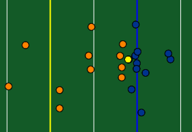

# Data Visualization Portfolio

## About Me
Welcome to my data visualization portfolio. This collection showcases projects that reflect both my technical skills in data analysis and my passion for football. Throughout my data science courses at Gettysburg College, I focused on NFL-related topics, aiming to turn complex data into clear, compelling insights. These projects represent work I enjoyed making, and I hope they serve as a stepping stone toward a future in data science and analytics.

To learn more about me, you can visit my [LinkedIn](https://www.linkedin.com/in/collin-ryan-510223250), my [github](https://github.com/ryanco01),

---

## Passing Heatmaps

<table align="right | left" style = "border-collapse: collapse; border: none;">
    <tr style = "border: none;">
        <td style="padding: 10px; width:25%; border: none;"> 
            
        </td>
        <td style="padding:10px; width:75%; border: none;" valign = "top">
            

            This project explores NFL quarterback passing. I was inspired by reddit user rj7002 and their rendition. The goal was to recreate this visual and then enhance it in my own way. ... <a href="./Passing Heatmap/README.md">Learn more</a>
              
            <i>Tools used: Python, Pandas, Plotly, Seaborn</i>
            

        </td>
    </tr> 
</table>

## NFL Passing Dashboard
<table align="right | left" style = "border-collapse: collapse; border: none;">
    <tr style = "border: none;">
        <td style="padding: 10px; width:25%; border: none;"> 
            
        </td>
        <td style="padding:10px; width:75%; border: none;" valign = "top">
            

            For this project I wanted to expand the passing heatmap into something more substantial and usable. Utilizing data from the Big Data Bowl, I created a dashboard of passing charts for NFL quarterbacks... <a href="./NFL Play Visualizer/README.md">Learn more</a>
              
            <i>Tools used: Python, Pandas, Seaborn, Plotly</i>
            

        </td>
    </tr> 
</table>

## Bill Belichick Infographic

<table align="right | left" style = "border-collapse: collapse; border: none;">
    <tr style = "border: none;">
        <td style="padding: 10px; width:25%; border: none;"> 
            
        </td>
        <td style="padding:10px; width:75%; border: none;" valign = "top">
            

            The goal of this project was to create a creative inforgraphic, one showcasing creative direction over pure data. I designed mine propping up who I feel is the greatest NFL head coach of all time, by exploring his decades of success...<a href="./BB Infographic/README.md">Learn more</a>
              
            <i>Tools used: Canva, Recraft</i>
            

        </td>
    </tr> 
</table>
