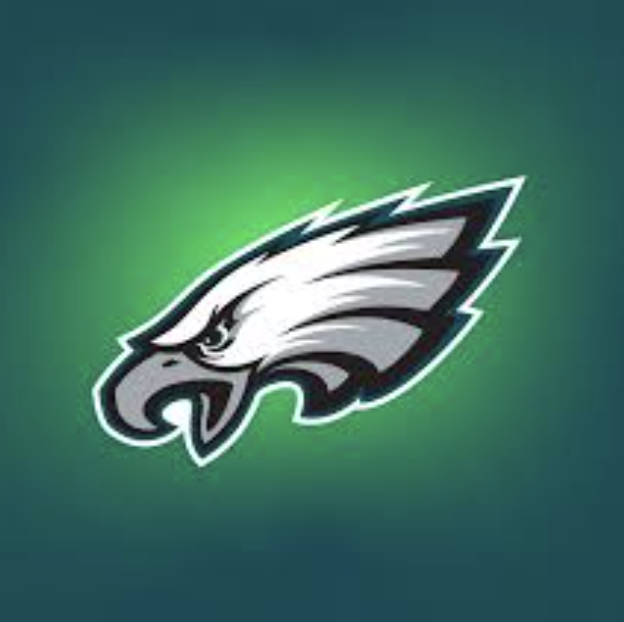
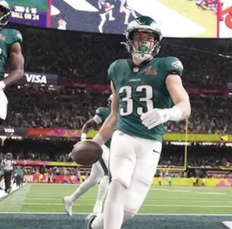

# Data Visualization Portfolio

## About Me
Use this space to introduce yourself to an audience (think about your target audience). Tell them about who you are, your skills, your strengths, your interests, and career aspirations.

Welcome to my data visualization portfolio! Here, you'll find a collection of projects showcasing my skills in data analysis and visualization. I am passionate about turning data into meaningful insights and compelling visuals.

<!--Include links to documents or sites that may be useful to your target audience: website, LinkedIn, your cv/resume, github, a community you contribute to, etc -->

To learn more about me, you can visit my [LinkedIn](www.linkedin.com/in/collin-ryan-510223250), my [github](https://github.com/ryanco01),

---

## Passing Heatmaps

<table align="right | left" style = "border-collapse: collapse; border: none;">
    <tr style = "border: none;">
        <td style="padding: 10px; width:25%; border: none;"> 
            
        </td>
        <td style="padding:10px; width:75%; border: none;" valign = "top">
            

            This project explores NFL quarterback passing. I was inspired by reddit user rj7002 and their rendition. The goal was to recreate this visual and then enhance it in my own way. ... <a href="./Project 1/README.md">Learn more</a>
              
            <i>Tools used: Python, Pandas, Plotly, Seaborn</i>
            

        </td>
    </tr> 
</table>

## Bill Belichick Infographic

<table align="right | left" style = "border-collapse: collapse; border: none;">
    <tr style = "border: none;">
        <td style="padding: 10px; width:25%; border: none;"> 
            
        </td>
        <td style="padding:10px; width:75%; border: none;" valign = "top">
            

            The goal of this project was to create a creative inforgraphic, I made one propping up who I feel is the greatest NFL head coach of all time, by exploring his decades of success...<a href="./Project 2/README.md">Learn more</a>
              
            <i>Tools used: Canva, Recraft</i>
            

        </td>
    </tr> 
</table>

## NFL Passing Dashboard
<table align="right | left" style = "border-collapse: collapse; border: none;">
    <tr style = "border: none;">
        <td style="padding: 10px; width:25%; border: none;"> 
            
        </td>
        <td style="padding:10px; width:75%; border: none;" valign = "top">
            

            For this project I wanted to expand the passing heatmap into something more substantial and usable. Utilizing data from the Big Data Bowl, I created a dashboard of passing charts for NFL quarterbacks... <a href="./Project 3/README.md">Learn more</a>
              
            <i>Tools used: Python, Pandas, Seaborn, Plotly</i>
            

        </td>
    </tr> 
</table>
